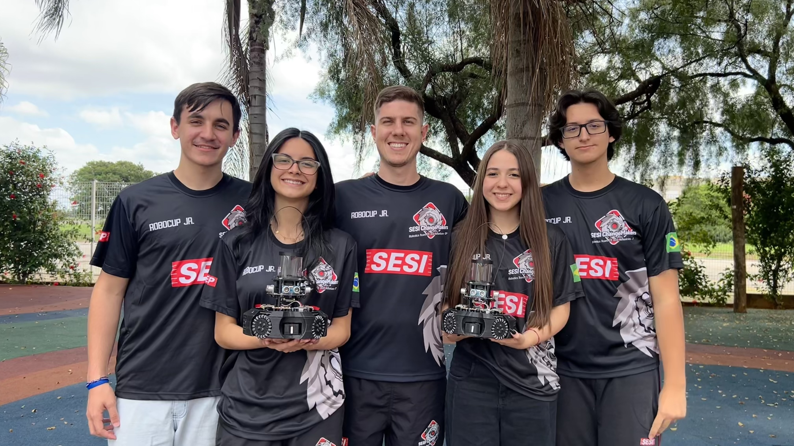

<h1>Robotics Repository – SESI ChangeMakers</h1>

<h2>RoboCupJunior Soccer Infrared</h2>

Welcome to the official repository of the SESI ChangeMakers team. This space has been organized to share our technical documentation, code, support materials, and lessons learned from the 2026 season.

<h2>Repository Objective</h2>

Centralize project information to facilitate study, the replication of solutions, and collaboration with other teams in the Soccer Infrared category.

<h2>2026 Team</h2>

  <table>
    <tr>
      <td>
        
      </td>
      <td style="text-align: center;">
        <ul>
          <li><strong>Lorenzo Pradal Malosso</strong> - Electronics Engineer</li>
          <li><strong>Clara Gonzaga Schiavon</strong> - Mechanical Engineer</li>
          <li><strong>Otávio Manderchiche</strong> - Programmer</li>
          <li><strong>Julia Guerra Menoni</strong> - Designer</li>
        </ul>
      </td>
    </tr>
  </table>

<h2>Tools and Technologies</h2>
<ul>
  <li>ESP32-S3 and OpenMV RT1062</li>
  <li>LDR's, HC-SR04, BNO055, and TSSP4038 sensors</li>
  <li>C/C++ and MicroPython language on the VisualStudio Code and OpenMV IDE platform</li>
  <li>GitHub for version control, organization, and sharing</li>
</ul>

<h2>Repository Structure</h2>
<ul>
  <li><a href="Soccer_Infrared_2026/Begginer's_Guide">Begginers's Guide</a></li>
  <li><a href="Soccer_Infrared_2026/Documentation">BOM - Bill of Materials and Poster</a></li>
  <li><a href="Soccer_Infrared_2026/Hardware">3D Models and Electronics</a></li>
  <li><a href="Soccer_Infrared_2026/Software">Programming Codes</a></li>
</ul>

<h2>Contact</h2>
<ul>
  <li>Email: sesichangemakers@gmail.com</li>
  <li>Instagram: <a href="https://www.instagram.com/_sesichangemakers">@_sesichangemakers</a></li>
</ul>
