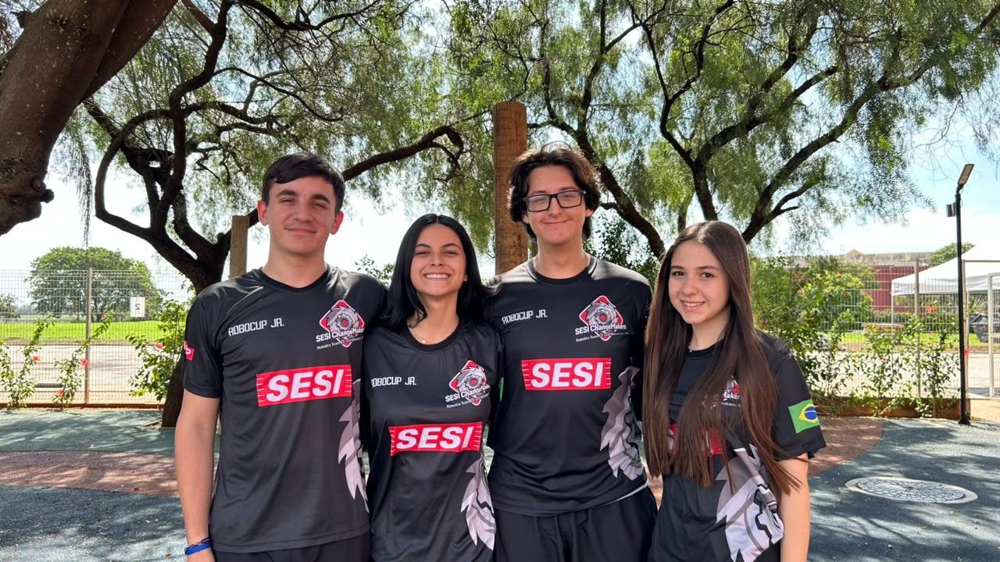

<h1>2026 Project - Soccer Infrared</h1>

Main directory for the SESI ChangeMakers team's 2026 season in the RoboCupJunior Soccer Infrared category.

  

<h2>Conteúdo disponível</h2>
<ul>
  <li><a href="Begginer's_Guide/">Beginner's_Guide/</a>: introductory materials on the competition's concepts and requirements, with practical guidance for beginner teams. The folder includes the PDF guide and its PowerPoint presentation.</li>
  <li><a href="Documentation/">Documentation/</a>: project materials and components list (BOM) and a poster featuring a visual presentation of the team and the robot.</li>
  <li><a href="Hardware/">Hardware/</a>: files organized into 3D models and electronics related to the robot's construction.</li>
  <li><a href="Software/">Software/</a>: code for CRONOS, the defensive robot, and NEXUS, the attacking robot, as well as code to test the robots' functionalities.</li>
</ul>

<h2>Purpose</h2>

Organize and make available the complete project development documentation for public and educational consultation.

